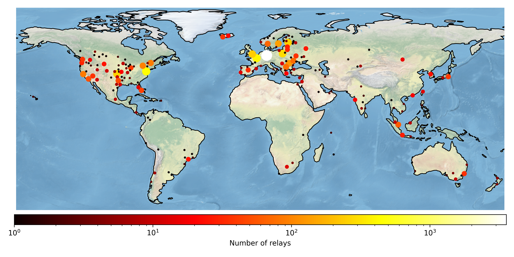
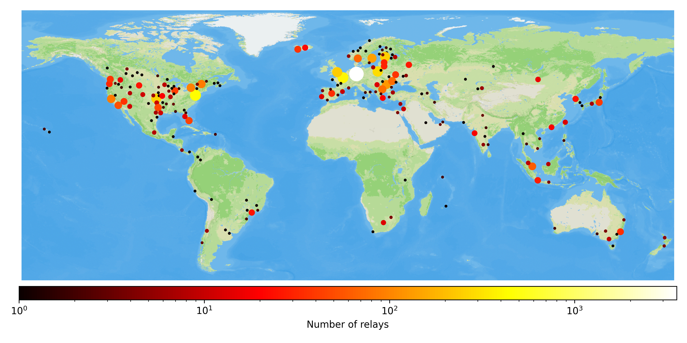

# Map Tor relays using Cartopy
Create a map showing the geographic location of the Tor relays

## Setup

1. Create a venv: `python -m venv venv && source venv/bin/activate`
2. Install requirements: `pip install -r requirements.txt`

## Get the data to create the map

You'll need two files:
1. The Tor consensus you want to use.  Download one at: https://metrics.torproject.org/collector/recent/relay-descriptors/consensuses/
2. The _GeoLite2 City_ file from MaxMind (not the CSV format).  See their website to create an account and get the file: https://dev.maxmind.com/geoip/geolite2-free-geolocation-data

## Run the program

The program takes two arguments: the filename of the consensus and the filename of the GeoLite2 mmdb file.

```shell
python map.py 2024-03-27-13-00-00-consensus GeoLite2-City.mmdb
```

A third (optional) parameter can control the density of the clusters.  The default is 1.5 and generally gives nice maps.
The higher the value, the bigger the clusters.

```shell
python map.py 2024-03-27-13-00-00-consensus GeoLite2-City.mmdb 1.5
```

## Using OSM data (optional)

It is possible to use data from OpenStreetMap as background (instead of the default cartopy image). 

Check the code and the `TODO` comment to enable that.  If you use OSM data and Mapbox as suggested in the comment,
please use attribute it properly.  

The following attribution line is generally enough:

> © <a href='https://www.mapbox.com/about/maps/'>Mapbox</a> © <a href='http://www.openstreetmap.org/copyright'>OpenStreetMap</a> <strong><a href='https://www.mapbox.com/map-feedback/' target='_blank'>Improve this map</a></strong>

## Attribution

This attribution or a similar should be included when you use this script with MaxMind data.

> This product includes GeoLite2 Data created by MaxMind, available from https://www.maxmind.com

## Examples of maps

### Default cartopy background



### With a custom style from MapBox
